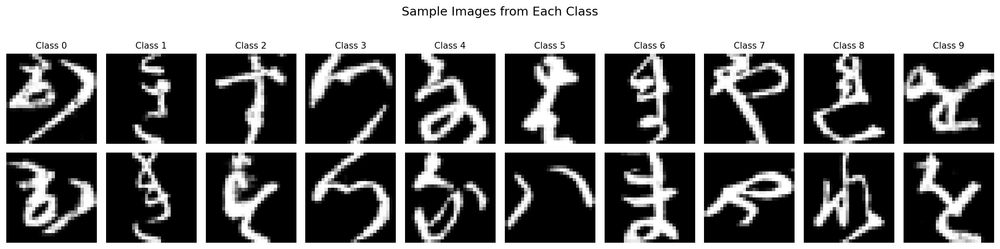

# KMNIST Fully-Connected Classifier

**95.96% test accuracy** on Kuzushiji-MNIST using only fully-connected layers — surpassing the published simple CNN benchmark (94.63%).

## Overview

A hypothesis-driven study of fully-connected neural networks for handwritten Hiragana character classification. Through 9 iterative experiments, this project systematically explores architecture design, regularisation, data augmentation strategies, and the relationship between parameter-to-data ratio and memorisation.

## Key Results

| Experiment | Architecture | Params | Data | Ratio | Test Acc | Gap |
|---|---|---|---|---|---|---|
| 1: Baseline | 784-256-10 | 204k | 60k | 3.4:1 | 87.75% | 9.12% |
| 2: +Dropout | 784-512-256-10 | 536k | 60k | 8.9:1 | 90.87% | 7.26% |
| 3: Optimised | 784-1024-512-256-10 | 1.46M | 60k | 24.4:1 | 93.39% | 6.58% |
| 4: +3x Aug | 784-1024-512-256-10 | 1.46M | 180k | 8.1:1 | 93.32% | 6.49% |
| 5: +12x Aug | 784-1024-512-256-10 | 1.46M | 720k | 2.0:1 | 95.34% | 3.84% |
| **6: +18x Aug** | **784-1024-512-256-10** | **1.46M** | **1.08M** | **1.4:1** | **95.96%** | **2.84%** |

## Key Findings

### Parameter-to-Data Ratio Governs Memorisation
Zhang et al. (2017) showed that overparameterised networks memorise entire datasets. Our experiments quantify this:
- **Ratio > 8:1** (Exp 3, 4): Model memorises everything (~99.9% train acc), regardless of augmentation level
- **Ratio ~ 2:1** (Exp 5): Critical threshold where memorisation is disrupted — test accuracy jumps +2 points
- **Ratio ~ 1.4:1** (Exp 6): Further improvement with diminishing returns

### 3x Augmentation Is Not Enough
Experiment 4 (3x augmented, 180k images) produced virtually no improvement over the non-augmented Experiment 3. The model simply memorised all 180k fixed copies. Only at 12x (720k) did the augmentation multiplier exceed the model's memorisation capacity.

### Architecture: Pyramid Rule Works
The geometric pyramid rule (Masters, 1993) — halving width each layer — proved effective. The tapering design (1024 -> 512 -> 256) forces hierarchical abstraction. Larger (+13.5%) and deeper architectures showed no improvement, confirming an optimal capacity exists for this task.

### Pre-Generated vs On-the-Fly Augmentation
Pre-generating augmented copies as GPU tensors is fast but creates fixed data that can be memorised. On-the-fly augmentation (regenerating random transforms each epoch) provides infinite diversity and showed promising results in later experiments (Exp 7-9).

## Architecture

```
Input (784) -> Linear(1024) -> ReLU -> Dropout(0.3)
            -> Linear(512)  -> ReLU -> Dropout(0.3)
            -> Linear(256)  -> ReLU -> Dropout(0.2)
            -> Linear(10)   [Output]

Optimizer: AdamW (lr=0.001, weight_decay=1e-4)
Loss: CrossEntropyLoss (label_smoothing=0.1)
Scheduler: ReduceLROnPlateau (factor=0.5, patience=10)
Gradient Clipping: max_norm=1.0
```

## Dataset

[Kuzushiji-MNIST](https://github.com/rois-codh/kmnist) (Clanuwat et al., 2018): 70,000 images of handwritten Hiragana characters, 28x28 grayscale, 10 classes.

<p align="center">
  
</p>

## Project Structure

```
notebooks/
  01-data-exploration.ipynb   # Dataset visualisation and analysis
  02-experiments.ipynb        # All 9 experiments with hypothesis testing
  03-part-a-perceptron.ipynb  # Perceptron from scratch (NumPy only)
report/
  report.pdf                  # Full written report with analysis
figures/                      # All experiment charts and confusion matrices
```

## How to Run

```bash
# Install dependencies (use CUDA version for GPU)
pip install -r requirements.txt

# Download KMNIST dataset
python -c "from torchvision.datasets import KMNIST; KMNIST('.', train=True, download=True); KMNIST('.', train=False, download=True)"

# Open notebooks
jupyter notebook notebooks/02-experiments.ipynb
```

## Tech Stack

- **PyTorch** — model definition and training
- **AdamW** — adaptive optimiser with decoupled weight decay
- **torchvision** — data augmentation transforms
- **scikit-learn** — confusion matrices
- **matplotlib** — visualisation

## References

- Zhang, C. et al. (2017). *Understanding deep learning requires rethinking generalization.* ICLR 2017. [arXiv:1611.03530](https://arxiv.org/abs/1611.03530)
- Arpit, D. et al. (2017). *A closer look at memorization in deep networks.* ICML 2017. [arXiv:1706.05394](https://arxiv.org/abs/1706.05394)
- Clanuwat, T. et al. (2018). *Deep Learning for Classical Japanese Literature.* [arXiv:1812.01718](https://arxiv.org/abs/1812.01718)
- Masters, T. (1993). *Practical Neural Network Recipes in C++.* Academic Press.
- Shorten, C. & Khoshgoftaar, T. (2019). *A survey on image data augmentation for deep learning.* Journal of Big Data.
